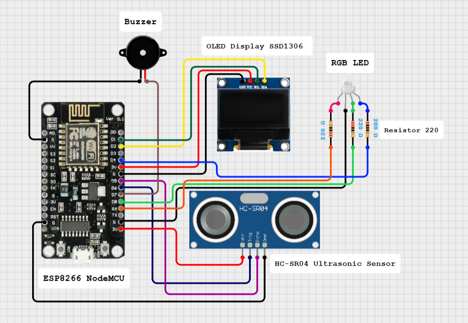

# 🚨 IoT-Based Flood Detection System with Blynk and OLED Display

## 🎥 Video Demonstration

Check it out on TikTok: [Video Demonstration](https://www.tiktok.com/@qubits.io/video/7530842254420774162?is_from_webapp=1&sender_device=pc&web_id=7491002461630400008)

---

## 📖 Project Description

This project is an IoT-based flood detection system using an **ESP8266** microcontroller, **ultrasonic sensor**, and **Blynk IoT platform**. It measures water level distance and provides **visual alerts (via OLED & LEDs)** and **audible alerts (via buzzer)**.

### ✨ Features

- 📏 **Distance Monitoring** using HC-SR04 (in cm and inches)
- 📱 **Real-time Data** sent to Blynk using virtual pins `V1` and `V2`
- 📺 **OLED Display** for local visualization of distance
- 🔴🔵🟢 **LED Indicators** for water level thresholds
- 🔊 **Buzzer Alarm** when water level is dangerously high
- ☁️ **Cloud Logging** via Blynk `logEvent("high_water_levels")`

---

## 🧰 Hardware Components

| Component                | Description                        |
|--------------------------|------------------------------------|
| ESP8266 NodeMCU          | Main microcontroller (Wi-Fi)       |
| HC-SR04 Ultrasonic Sensor| Distance measurement               |
| OLED SSD1306 (128x64)    | Displays real-time distance data   |
| Buzzer                   | Audible alert                      |
| Red, Blue, Green LEDs    | Visual indicators for distance     |
| 220Ω Resistors (x3)      | Current-limiting for LEDs          |
| Jumper Wires             | Connections                        |
| Breadboard               | Prototyping                        |

---

## 🔌 Pin Connections

| Component      | Pin Label | ESP8266 GPIO | NodeMCU Pin |
|----------------|-----------|--------------|-------------|
| **Ultrasonic** | Trig      | GPIO12       | D6          |
|                | Echo      | GPIO14       | D5          |
| **Buzzer**     | +         | GPIO13       | D7          |
| **Red LED**    | +         | GPIO3        | D9 (RX)     |
| **Blue LED**   | +         | GPIO2        | D4          |
| **Green LED**  | +         | GPIO15       | D8          |
| **OLED**       | SDA       | GPIO4        | D2          |
|                | SCL       | GPIO5        | D1          |

---

## 🖼️ Circuit Diagram

---
## 📱 Blynk Setup Tutorial

1. **Download the Blynk IoT App** (Android/iOS)

2. **Create a New Template**  
   - Name: `Flood Detection`  
   - Hardware: `ESP8266`  
   - Connection Type: `WiFi`  
   - Save the `Template ID`, `Device Name`, and `Auth Token`.

3. **Create a New Device**  
   - Use the template above  
   - Name your device and save

4. **Create Web/Mobile Dashboard**  
   - Add **Label** or **Gauge** widgets  
   - Assign `V1` for **Distance (cm)**  
   - Assign `V2` for **Water Level (%)**

5. **Enable Events (Optional)**  
   - Go to **Events**  
   - Add `high_water_level`  
   - Use `Blynk.logEvent("high_water_level")` in your code

## 🧰 Library Installation

In the Arduino IDE:

1. Go to **Sketch** > **Include Library** > **Manage Libraries**
2. Install the following libraries:
   - `Blynk` by Volodymyr Shymanskyy
   - `ESP8266WiFi`
   - `Adafruit SSD1306`
   - `Adafruit GFX`

## 🔌 Uploading the Code

1. Connect your ESP8266 to your computer via USB.
2. Open the `.ino` sketch and make sure you've inserted:
   - Your **WiFi SSID and Password**
   - Your **Blynk Template ID, Device Name, Auth Token**
3. Click **Upload**.
4. Open the **Serial Monitor** at `115200` baud to verify connection to Wi-Fi and Blynk.

## 📊 Viewing Data on Blynk Dashboard

- Use your **Web or Mobile Dashboard** to see real-time:
  - Distance in centimeters (`V1`)
  - Water level percentage (`V2`)
- (Optional) Set up alerts for `high_water_level` in Blynk console
  
## ✅ Result

You now have a live flood detection system that:
- Displays data on an OLED screen
- Sends real-time data to Blynk IoT platform
- Alerts you when water reaches dangerous levels (optional)
  
---

## 📜 License

This project is licensed under the **MIT License**. See the [LICENSE](LICENSE) file for full details.
